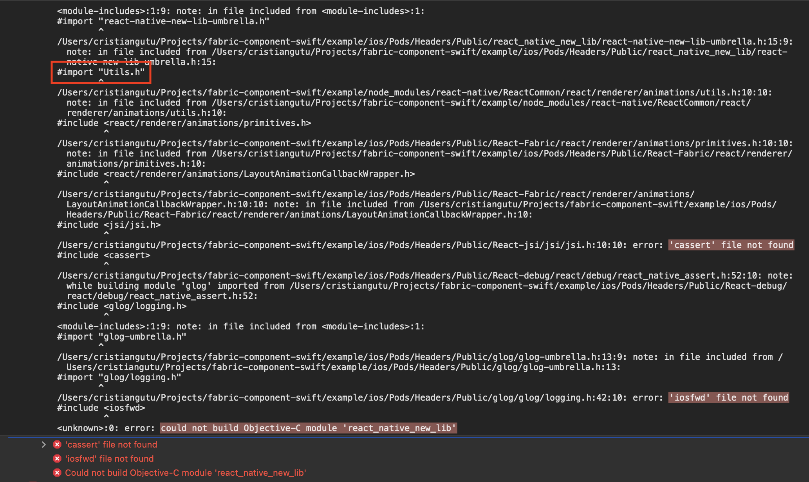

# Swift Example Project

In this example project, we have a React Native library with a Turbo Module using Swift and a Fabric component using Swift.

For a step-by-step guide, [check out this article](https://www.cristiangutu.pro/using-swift-in-fabric-components-and-turbo-modules/).

## Run the Example project

- `yarn`
- `cd example/ios`
- `bundle install`
- `RCT_NEW_ARCH_ENABLED=1 pod install`
- Open the `example/ios/NewLibExample.xcworkspace` project in Xcode and run it.


## Usage

Check out the `example/src/App.tsx` to see how this is being used.

```js
import { multiply, MyComponentView } from 'react-native-new-lib';

// ...

const result = await multiply(3, 7);

return <MyComponentView style={{ width: 60, height: 60 }} color="#64C17F" />
```

## Key takeaways from this project

- Make sure to install the Pod dependencies for the New Arhictecture, `RCT_NEW_ARCH_ENABLED=1 pod install`
- When exposing Swift code, make sure to add `@objc public` to classes and methods you want to expose in Objective-C/C++.
- You can have access to Swift code in Objective-C/C++ by importing a generated Swift header, `#import (your podspec name)-Swift.h`
- The Swift header name will always have the `-` chars replaced with `_`, so if your library is `react-native-new-lib`, the generated header will look like this: `react_native_new_lib-Swift.h`
- The default template project for a Turbo modules, it's not configured to pick up Swift files, make sure to have this line `s.source_files = "ios/**/*.{h,m,mm,swift}"` in your `.podspec` file.
- If you want to have Turbo Modules and Fabric components in the same project, make sure to specify `all` in your `codeGenConfig` from `package.json`:
```
"codegenConfig": {
  "name": "RNNewLibSpec",
  "type": "all", 👈
  "jsSrcsDir": "src"
}
```
- The template Fabric component project won't compile with Swift if you import pure C/C++ headers (you need to delete the Utils.m and Utils.h files). If you encounter any errors that look like this, it's because you're have those files in the project.



## Show your support

* 🏋️‍♂️ Follow me on Twitter [@GutuCristian](https://twitter.com/GutuCristian) or [LinkedIn](https://www.linkedin.com/in/cristiangutu/) for updates.
* ⭐️ Star this repo.

## Contributing

See the [contributing guide](CONTRIBUTING.md) to learn how to contribute to the repository and the development workflow.

## License

MIT

---

Made with [create-react-native-library](https://github.com/callstack/react-native-builder-bob)
